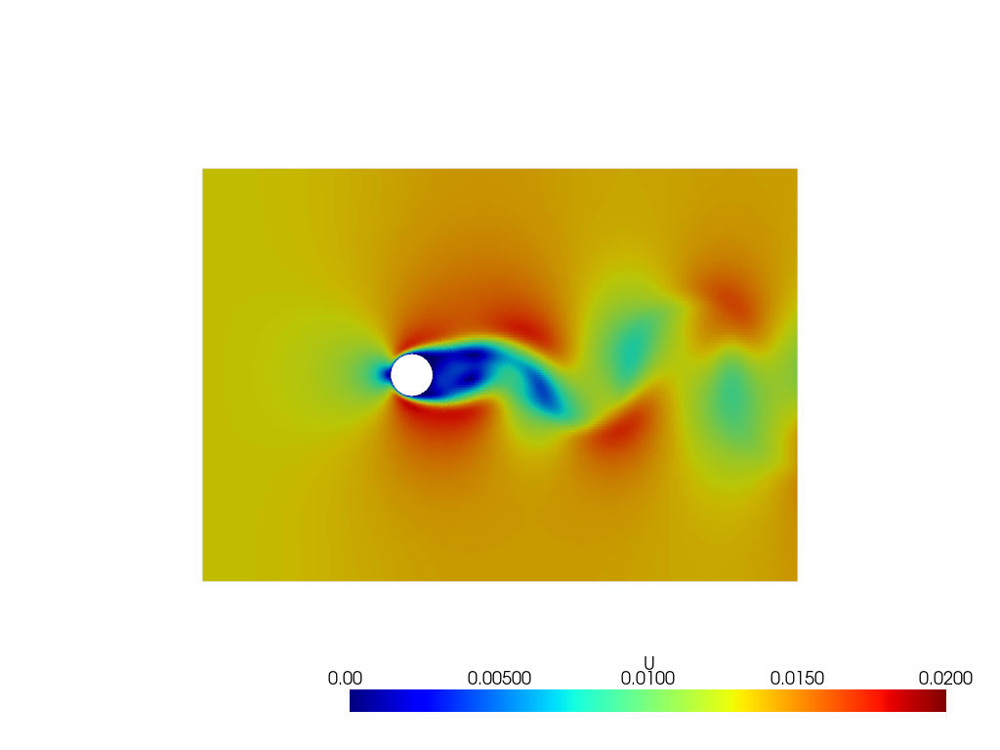

# PyVista4OpenFOAM
Tutorial repository on how to use PyVista to plot/manipulate OpenFOAM results.

## Requirements

- `pyvista`
- `Python >= 3.8`
- `IPykernel`
- `fluidfoam` (optional to use utils.py)

